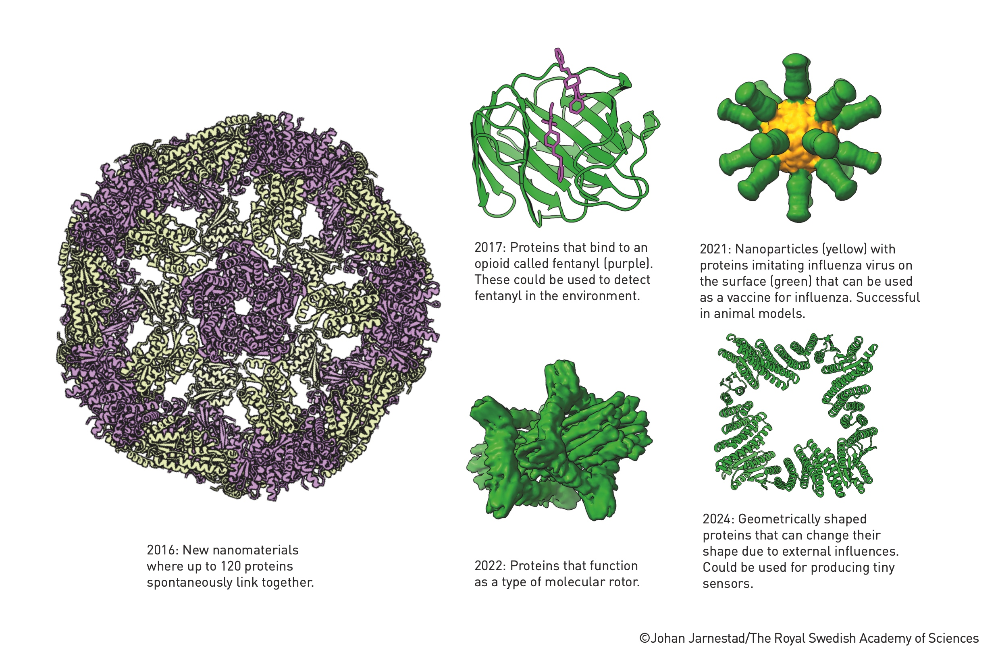

# Session 1 - Computational Protein Design and De Novo Protein Engineering

The 2024 Nobel Prize in Chemistry was awarded to David Baker for his groundbreaking work in de novo protein engineering. This session explores the revolutionary field of computational protein design, its methods, applications, and broader implications for synthetic biology and biotechnology.

## Understanding Proteins: The Building Blocks of Life

Before diving into protein design, let's understand what proteins are and why they're so important.

As shown in Image 1, proteins are long chains of amino acids. There are 20 different amino acids that can be combined in countless ways to create proteins with various functions. The sequence of these amino acids determines how the protein folds into its 3D structure, which in turn determines its function.

## What is De Novo Protein Design?

De novo protein design aims to create entirely new proteins that don't exist in nature. Unlike traditional protein engineering that modifies existing proteins, de novo design starts from scratch.

### Why is this important?

1. **Custom Functions**: We can create proteins to perform specific tasks that natural proteins can't do.
2. **Solving New Problems**: These designed proteins can address challenges in medicine, environmental science, and industry.
3. **Advancing Synthetic Biology**: It's a step towards designing entirely new biological systems.

## The Rosetta Platform: A Revolutionary Tool

At the heart of Baker's work is the Rosetta software platform. Think of Rosetta as a highly sophisticated puzzle solver for proteins.

### How Rosetta Works:

1. **Energy Landscape Exploration**: Proteins naturally fold into their lowest energy state. Rosetta simulates this process by exploring various folding possibilities to find the most stable structure.
2. **Sequence Optimization**: It can suggest amino acid sequences that will likely fold into a desired structure.
3. **Function Prediction**: Rosetta can also predict how a designed protein might function based on its structure.

## The Protein Design Process

Let's break down the process of designing a new protein:

1. **Define the Goal**: Decide what you want the protein to do (e.g., bind to a specific molecule, catalyze a reaction).
2. **Design the Structure**: Use Rosetta to design a protein structure that could achieve this goal.
3. **Optimize the Sequence**: Determine the best amino acid sequence to create this structure.
4. **Simulate and Refine**: Use computer simulations to predict how well the design will work and make improvements.
5. **Synthesize and Test**: Create the protein in the lab and test if it functions as intended.

## Applications of De Novo Proteins

The ability to design proteins from scratch has opened up numerous exciting applications:

### 1. Medical Innovations

- **Novel Enzymes and Therapeutics**: We can design proteins to catalyze reactions not found in nature, potentially leading to new drugs or treatments.
- **Vaccine Development**:

As shown in Image 4, researchers have designed nanoparticles with proteins that mimic viruses, which can be used as vaccines. The image shows a 2021 example of nanoparticles with proteins imitating the influenza virus, which was successful in animal models.

### 2. Environmental Solutions

Image 5 shows an example from 2022 of natural enzymes that can decompose plastic. The goal is to design proteins that can be used to recycle plastic more efficiently.

### 3. Industrial Applications

- **Biocatalysts**: Designed proteins can catalyze industrial reactions more efficiently and with less environmental impact.
- **Materials Science**: Custom proteins can be used to create new materials with unique properties.

## Challenges and Future Directions

While de novo protein design has made incredible strides, there are still challenges:

1. **Predicting Dynamics**: It's difficult to predict how proteins will move and interact over time.
2. **Stability**: Ensuring designed proteins remain stable in various environments is crucial.
3. **Unintended Interactions**: We need to be careful that new proteins don't interact negatively with existing biological systems.

## The Future of Synthetic Biology

Baker's work in protein design is paving the way for even more ambitious goals in synthetic biology. In the future, we might be able to:

- Design entire cellular pathways
- Create synthetic organisms for specific purposes
- Develop new solutions for global challenges in health, energy, and the environment

## Key Takeaways

1. **Revolutionary Approach**: De novo protein design allows us to create proteins that don't exist in nature.
2. **Powerful Tools**: Platforms like Rosetta and AlphaFold are making protein design more accessible and accurate.
3. **Wide-Ranging Applications**: From medicine to environmental science, designed proteins are opening new possibilities.
4. **Ongoing Challenge**: While we've made great strides, there's still much to learn about protein design and function.
5. **Ethical Considerations**: As we gain the ability to design life at the molecular level, we must carefully consider the ethical implications of this technology.

David Baker's work has truly opened a new frontier in biology and chemistry. As we continue to refine our ability to design proteins, we're moving closer to a future where we can engineer biological solutions to some of our most pressing global challenges.
