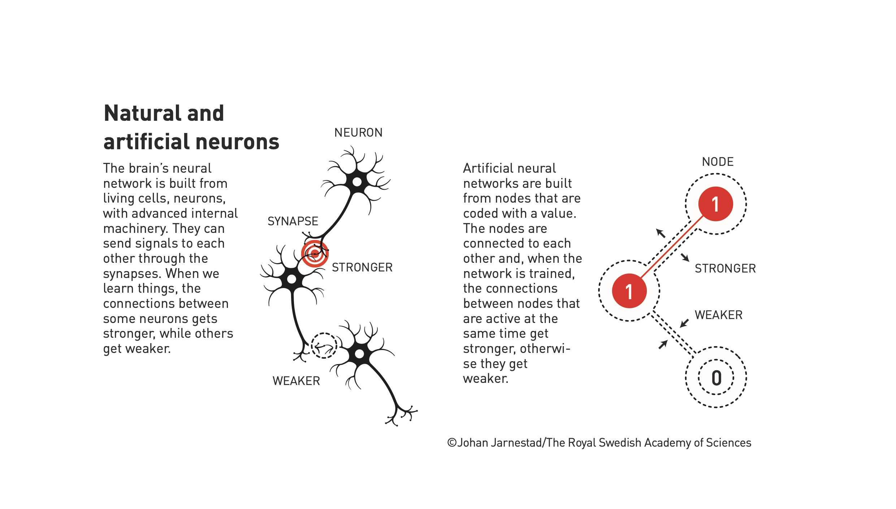
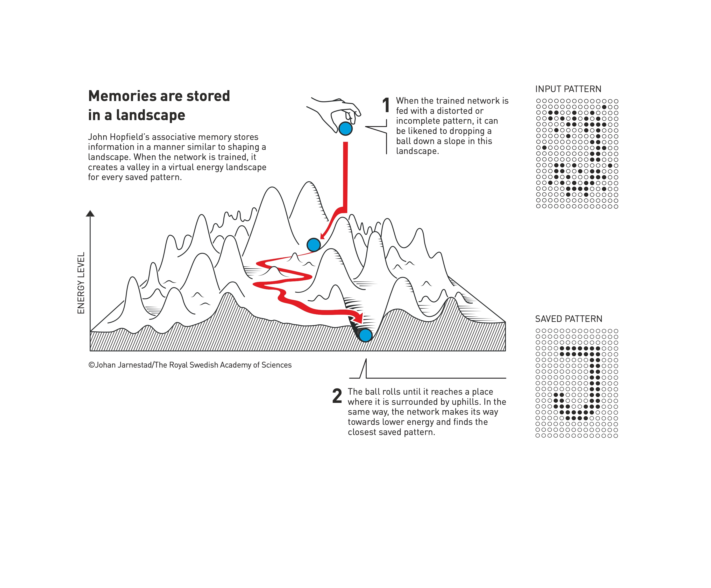

# Session 1: Foundational Discoveries in Machine Learning with Artificial Neural Networks

This session will cover the historical evolution, foundational concepts, and the pioneering work by John J. Hopfield and Geoffrey E. Hinton that led to the development of modern artificial neural networks (ANNs).

## Introduction to Artificial Neural Networks (ANNs)

- **Historical Background**: The concept of **artificial neural networks** (ANNs) dates back to the 1940s, inspired by the functioning of biological neurons.

  

  - **Warren McCulloch** and **Walter Pitts** (1943): Proposed a model of artificial neurons using simple binary signals, serving as the basis for future developments in ANNs.
  - **Donald Hebb** (1949): Introduced the **Hebbian learning principle**, suggesting that neurons strengthen connections when activated together, a concept still used in training neural networks.

- **First Era of ANN Development** (1950s-1980s): ANNs initially struggled due to computational limitations, particularly highlighted by the **XOR problem** (Minsky and Papert, 1969), which demonstrated the shortcomings of early perceptron models. Research slowed until the 1980s, when new approaches emerged.

  

## John J. Hopfield and the Hopfield Network

- **Associative Memory and Recurrent Networks**: In 1982, **John Hopfield** introduced a type of recurrent neural network called the **Hopfield network**.
  - **Structure**: A **fully connected network** where each node is linked to every other node.
  - **Energy Landscape Analogy**: The Hopfield network stores information as **attractor states** in a conceptual energy landscape. When an incomplete or noisy input is given, the network finds the nearest stored pattern by minimizing energy, much like a ball rolling into the nearest valley.
    
  - **Application**: The network serves as an **associative memory**, useful for pattern recognition, error correction, and reconstructing distorted information. This ability resembles human memory retrieval, where similar memories are used to reconstruct partial information.

## Geoffrey Hinton and the Boltzmann Machine

- **Expansion on Hopfield's Concepts**: In the early 1980s, **Geoffrey Hinton** built on Hopfield's work to create the **Boltzmann machine** (1983-1985), introducing stochastic elements and hidden nodes.
  - **Stochastic Learning**: The Boltzmann machine incorporates a probability-based approach to learning using **Boltzmann's equation** from statistical physics. This approach allows the network to explore different configurations to find optimal patterns, making it a **generative model** capable of creating new data.
  - **Structure and Learning**: The Boltzmann machine is typically organized into visible and hidden nodes. Hidden nodes help model complex data relationships, capturing features that are not directly observable.
  - **Restricted Boltzmann Machine (RBM)**: A simplified version, the RBM, removes certain connections to make training more efficient. **Layer-wise pretraining** using RBMs became a pivotal step towards training deep networks, providing the foundation for **deep learning**.

## Impact of Hopfield and Hinton's Work

- **Connection to Physics**: Both Hopfield and Hinton used principles from **statistical mechanics** to develop ANN models.
  - **Hopfield's Energy Function**: The network's stability and memory retrieval properties are explained using energy minimization, similar to **magnetic spin systems** in physics.
  - **Hinton's Boltzmann Machine**: The generative aspect of the Boltzmann machine is rooted in **statistical thermodynamics**, with the system evolving to minimize energy while learning complex probability distributions.

## Applications and Broader Implications

- **Scientific Impact**: The breakthroughs by Hopfield and Hinton revolutionized various fields:
  - **Image and Speech Recognition**: ANN-based methods became essential in computer vision and natural language processing.
  - **Medical Diagnosis**: Early ANN models were used for pattern recognition in medical imaging, contributing to advances in **automated diagnostics**.
  - **Deep Learning Foundations**: The work of Hopfield and Hinton laid the groundwork for **deep neural networks** that form the basis of many AI systems today, including **large language models** and **generative adversarial networks (GANs)**.

## Key Takeaways

- **Biological Inspiration**: ANNs are inspired by the functioning of biological neurons but are designed to operate mathematically and computationally to solve specific tasks.
- **Energy Landscape Analogy**: The concept of energy minimization in Hopfield networks provides a useful metaphor for understanding how neural networks optimize and store information.
- **From Hopfield to Hinton**: The transition from **deterministic associative networks** (Hopfield) to **probabilistic generative models** (Hinton) marked a major evolution in machine learning capabilities.
