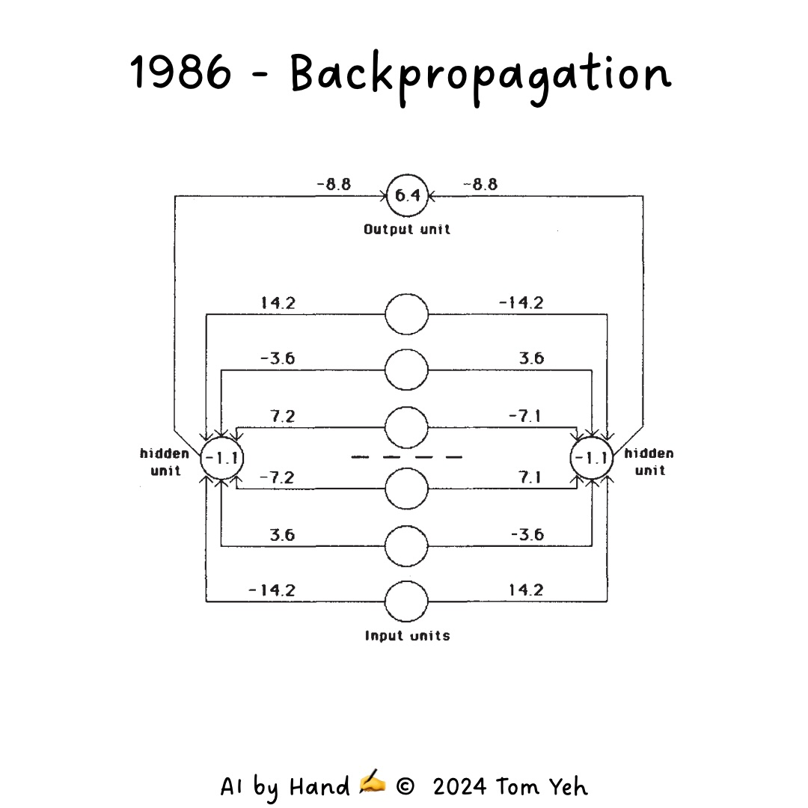
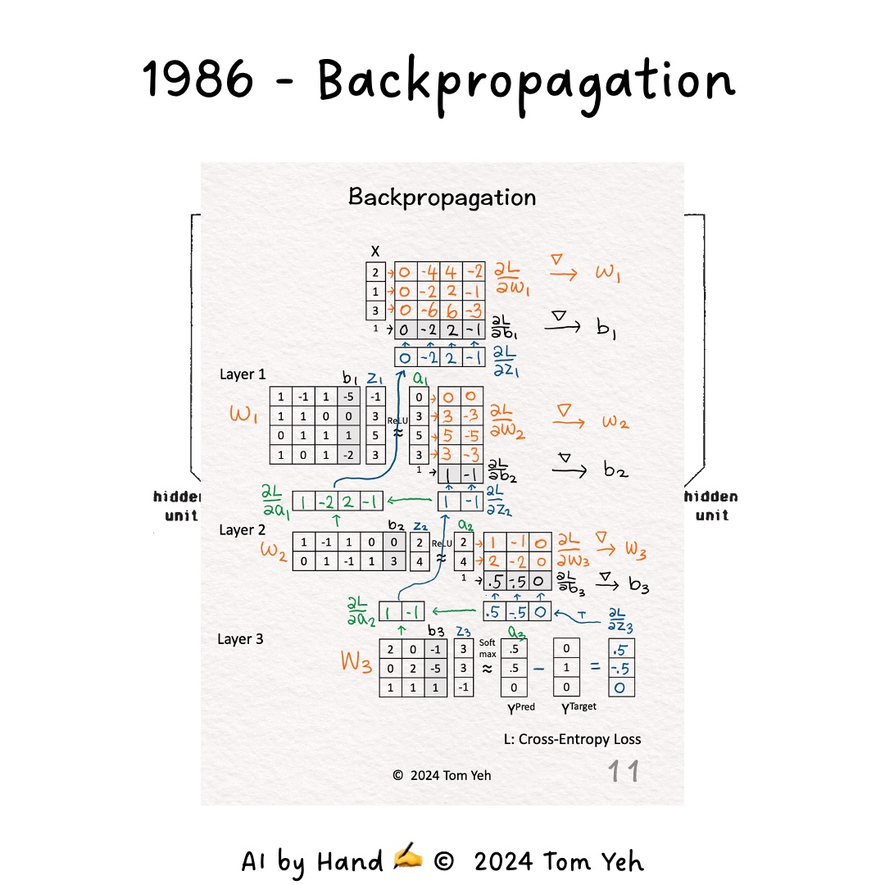
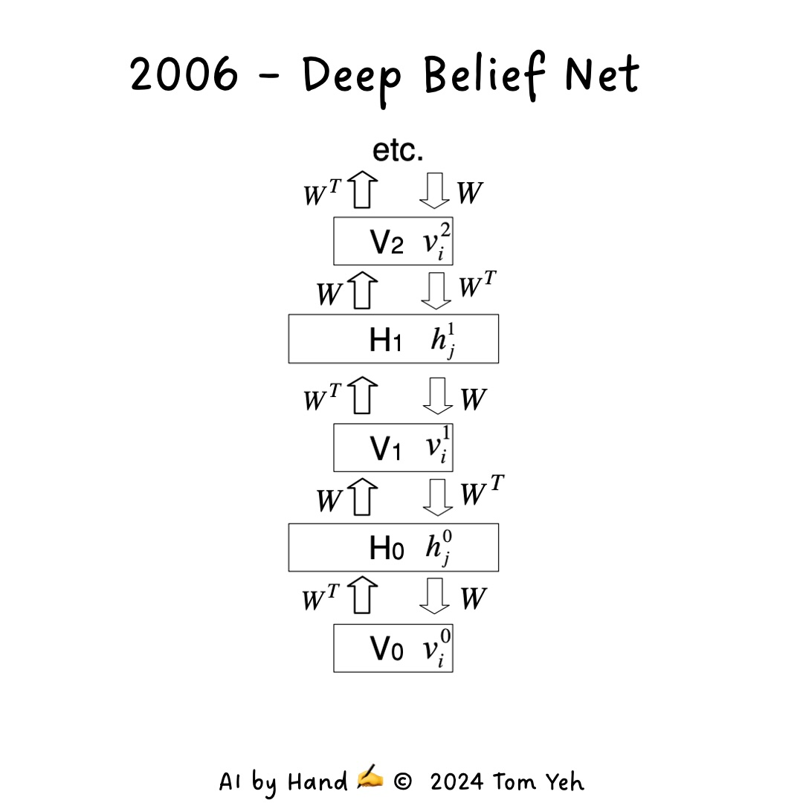
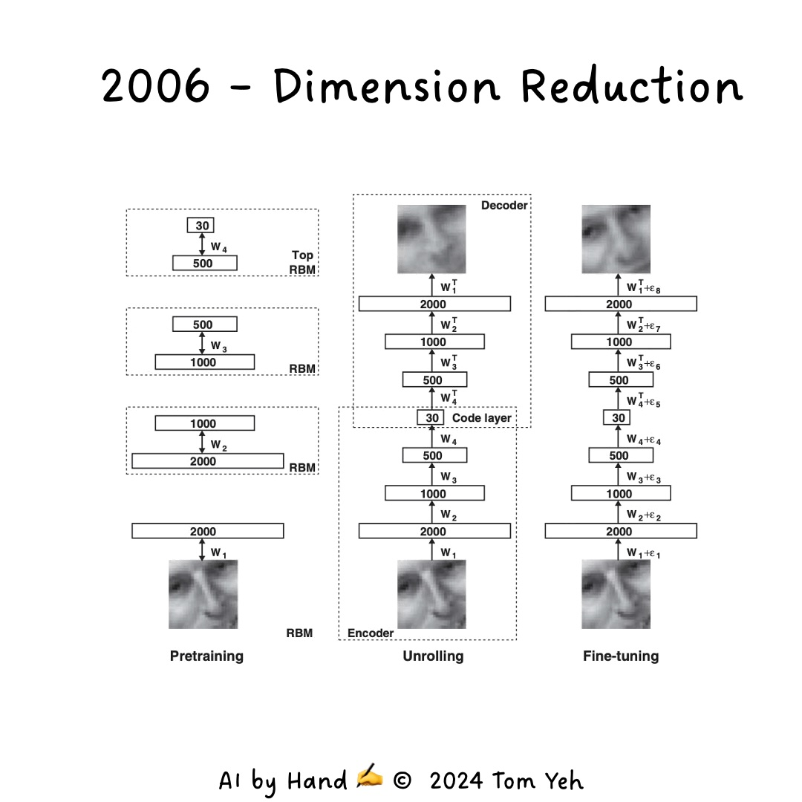
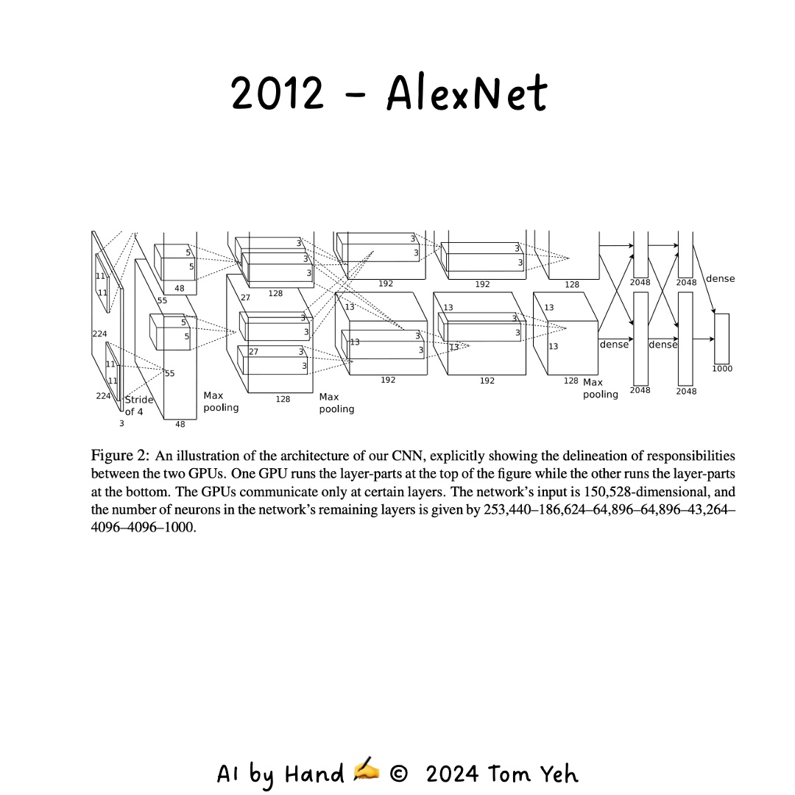
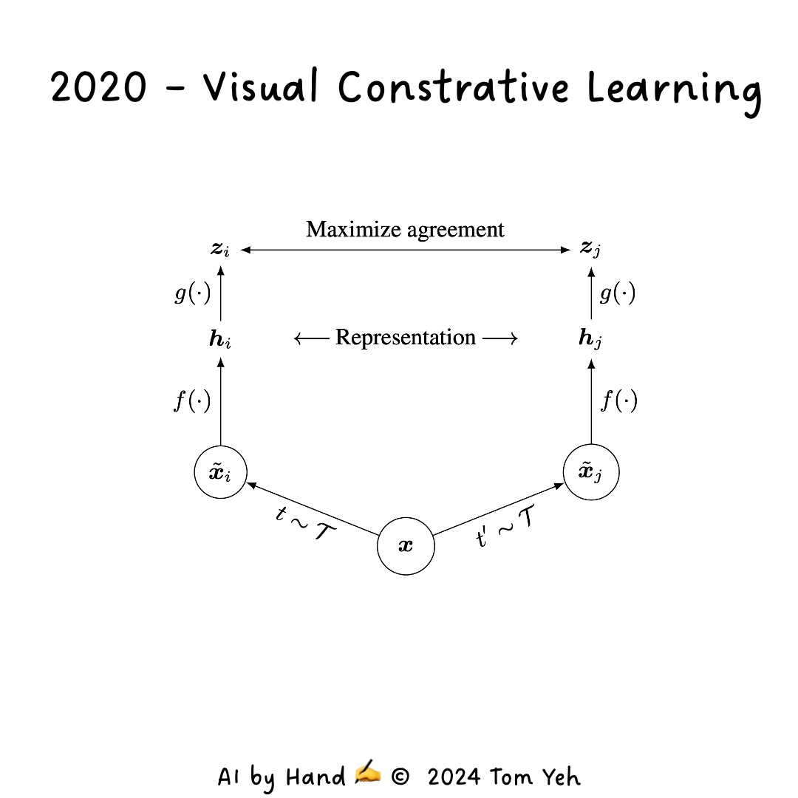

# Session 2: Deep Learning Evolution and Advanced Neural Network Architectures

This session explores the fascinating journey from foundational neural network models to modern deep learning architectures. We'll focus on the pivotal contributions of Geoffrey Hinton, the development of convolutional neural networks (CNNs), and the groundbreaking introduction of transformer models. This evolution has revolutionized artificial intelligence, enabling machines to process and understand complex data in ways that were once thought impossible.

## The Rise of Deep Learning

### Challenges in Training Deep Networks

During the 1990s and early 2000s, researchers faced significant hurdles in training deep neural networks (DNNs). One of the most prominent issues was the **vanishing gradient problem**.

#### Vanishing Gradient Problem Explained

Imagine you're trying to pass a message through a long chain of people. As the message travels, it becomes distorted, and by the time it reaches the end, it might be unrecognizable. Similarly, in deep neural networks, as we add more layers, the gradients (which are like our "message") used to update the weights become extremely small (or "vanish") as they're propagated backwards through the network. This makes it difficult for the earlier layers to learn effectively, as they receive very little meaningful feedback.

### Breakthrough with Restricted Boltzmann Machines (RBMs)

In 2006, Geoffrey Hinton introduced a novel approach to tackle these challenges using **Restricted Boltzmann Machines (RBMs)** and **layer-wise pretraining**.

#### Layer-wise Pretraining

This technique involves training the network one layer at a time, starting from the input layer and moving towards the output layer. Each layer is initially trained as an RBM, which learns to reconstruct its input. After this pretraining phase, the entire network is fine-tuned using backpropagation.

Think of it like building a skyscraper: instead of trying to construct all floors simultaneously, we build and stabilize each floor before moving to the next. This approach helps in initializing the weights of the network in a better state, making the subsequent fine-tuning process more effective.

## Geoffrey Hinton's Key Contributions to Neural Networks

Geoffrey Hinton, often referred to as the "Godfather of Deep Learning," has made several groundbreaking contributions that have shaped the field of neural networks and artificial intelligence.

### 1. Backpropagation (1986)

In 1986, Hinton, along with David Rumelhart and Ronald Williams, introduced the **backpropagation algorithm** for training multi-layer neural networks.

#### How Backpropagation Works

Imagine you're adjusting the aim of a complex trebuchet to hit a target. You make a shot, see how far off you are, and then adjust each part of the machine accordingly. Backpropagation works similarly:

1. The network makes a prediction.
2. The error (difference between prediction and actual output) is calculated.
3. This error is then propagated backwards through the network.
4. Each weight is adjusted based on its contribution to the error.

This process allows the network to learn from its mistakes and gradually improve its performance, much like how you'd fine-tune the trebuchet with each attempt.

### 2. Deep Belief Nets (DBNs) (2006)

In 2006, Hinton introduced **Deep Belief Networks (DBNs)**, which use layer-wise pretraining to overcome the vanishing gradient problem.

#### Understanding DBNs

Think of DBNs as a tower of building blocks, where each block is an RBM. The network is built from the bottom up, with each layer learning to represent the data it receives from the layer below. This approach allows the network to learn increasingly abstract features as you move up the layers.

For example, in image recognition:

- The first layer might learn to detect edges.
- The second layer might combine these edges to recognize simple shapes.
- Higher layers might recognize more complex patterns like faces or objects.

This hierarchical learning makes DBNs particularly effective for complex pattern recognition tasks.

### 3. Dimension Reduction Using RBMs (2006)

Also in 2006, Hinton and Ruslan Salakhutdinov demonstrated the use of RBMs for **dimension reduction**.

#### Dimension Reduction Explained

Imagine you have a large, detailed map of a city, but you need to represent it on a small piece of paper. You'd have to simplify it, keeping only the most important features. This is essentially what dimension reduction does with data.

RBMs can learn to compress high-dimensional data (like images) into a lower-dimensional representation that captures the most important features. This makes subsequent processing more efficient and can help in tasks like data compression, feature extraction, and even in generating new data samples.

### 4. AlexNet (2012)

In 2012, Hinton, along with his students Alex Krizhevsky and Ilya Sutskever, developed AlexNet, a convolutional neural network that won the ImageNet competition and revolutionized computer vision.

#### AlexNet's Impact

AlexNet was a game-changer for several reasons:

1. **Deep Architecture**: It used multiple convolutional layers, allowing it to learn complex features from images.
2. **GPU Acceleration**: It leveraged GPU computing, enabling the training of much larger networks than before.
3. **Novel Techniques**: It introduced techniques like ReLU activation and dropout, which are now standard in many neural networks.

AlexNet's success in the ImageNet competition (reducing the error rate from 26% to 15.3%) marked the beginning of the deep learning revolution in computer vision.

### 5. Visual Contrastive Learning (2020)

In 2020, Hinton contributed to advancements in **contrastive learning** for visual tasks.

#### Understanding Contrastive Learning

Contrastive learning is like teaching a child to recognize objects by showing them pairs of images and asking, "Are these the same object?" Over time, the child (or in this case, the neural network) learns to identify key features that distinguish different objects.

In the context of machine learning:

1. The network is shown different augmentations (like rotations or color changes) of the same image.
2. It learns to recognize that these augmentations represent the same underlying image.
3. This process helps the network learn robust visual representations without needing labeled data.

This approach has been particularly useful in scenarios where labeled data is scarce or expensive to obtain.

## Convolutional Neural Networks (CNNs)

While Hinton's work revitalized deep learning, Yann LeCun and others advanced a special class of neural networks called **Convolutional Neural Networks (CNNs)**.

### How CNNs Work

Imagine you're looking at a large mural. You don't take in the entire image at once; instead, your eyes scan across it, focusing on different parts. CNNs work similarly:

1. **Convolutional Layers**: These act like a sliding window, scanning across the image and detecting features like edges, textures, and shapes.
2. **Pooling Layers**: These summarize the features detected in a particular region, making the network more robust to small variations in position.
3. **Fully Connected Layers**: These take the high-level features learned by the convolutional and pooling layers and use them to make the final classification.

This architecture makes CNNs particularly effective for tasks like image classification, object detection, and even facial recognition.

## Recurrent Neural Networks and LSTMs

To handle sequential data like text or time series, researchers developed **Recurrent Neural Networks (RNNs)** and their more advanced variant, **Long Short-Term Memory (LSTM) networks**.

### Understanding RNNs and LSTMs

Think of an RNN as a network with a memory. When processing a sequence (like a sentence), it considers not just the current input, but also what it has seen before. However, basic RNNs struggle with long-term dependencies.

LSTMs, introduced by Sepp Hochreiter and Jürgen Schmidhuber, solve this problem by using a more sophisticated memory cell. They can selectively remember or forget information, allowing them to capture long-term dependencies more effectively.

For example, in language translation, an LSTM can remember the subject of a sentence even if it's separated from its verb by many words, ensuring grammatical correctness in the translation.

## Transformer Networks

In 2017, Vaswani et al. introduced the **transformer architecture**, which has become the backbone of many state-of-the-art language models.

### How Transformers Work

Transformers use a mechanism called **self-attention**, which allows them to weigh the importance of different parts of the input when processing each element.

Imagine you're at a party trying to follow multiple conversations. You pay attention to different speakers based on what's relevant to you. Transformers work similarly:

1. For each word in a sentence, the transformer calculates how much attention to pay to every other word.
2. This allows it to capture complex relationships between words, even if they're far apart in the sentence.
3. Unlike RNNs, transformers can process all words in parallel, making them much faster to train.

Transformers have revolutionized NLP tasks like machine translation, text generation, and question answering. Models like BERT and GPT, which are based on the transformer architecture, have set new benchmarks in language understanding and generation.

## Applications and Future Directions

The advancements in neural network architectures have led to breakthrough applications across various domains:

- **Image and Speech Recognition**: CNNs have enabled accurate object detection in images and real-time speech recognition.
- **Natural Language Processing**: Transformer-based models power advanced chatbots, machine translation systems, and even AI writing assistants.
- **Healthcare**: Deep learning models are being used for medical image analysis, drug discovery, and personalized medicine.
- **Autonomous Vehicles**: CNNs and other deep learning models are crucial for perception and decision-making in self-driving cars.

As these technologies continue to evolve, we can expect to see even more sophisticated AI systems that can understand and interact with the world in increasingly human-like ways.

## Key Takeaways

1. **Layer-wise Training**: This technique, pioneered by Hinton, was crucial in overcoming the challenges of training deep networks.
2. **Specialized Architectures**: CNNs for visual tasks and transformers for sequential data have dramatically improved AI's ability to process complex, real-world information.
3. **Scalability and Efficiency**: Modern architectures like transformers have made it possible to train enormous models on vast datasets, pushing the boundaries of what AI can achieve.
4. **Interdisciplinary Impact**: The evolution of neural networks has had far-reaching effects across numerous fields, from healthcare to autonomous systems.

As we continue to refine these architectures and develop new ones, the potential applications of AI are bound to expand, promising exciting developments in the years to come.
