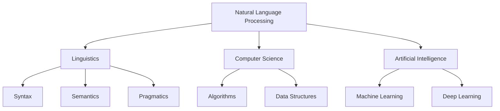
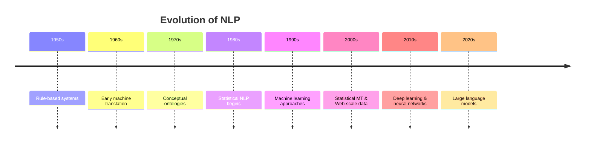
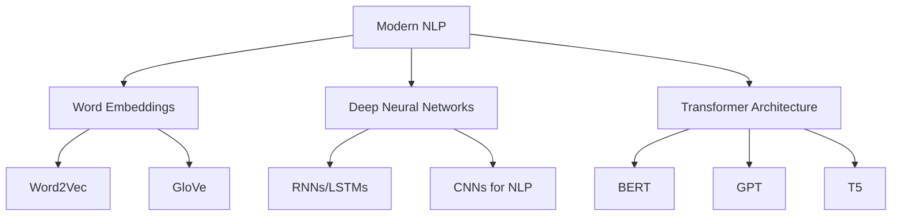
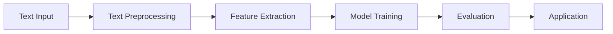

# Session 1 - Natural Language Processing

## 1. Introduction to Natural Language Processing (NLP)

### 1.1 Definition of NLP

Natural Language Processing (NLP) is an interdisciplinary field that combines linguistics, computer science, and artificial intelligence to enable computers to understand, interpret, and generate human language. The primary goal of NLP is to bridge the gap between human communication and computer understanding.



### 1.2 Basic Concepts

Key concepts in NLP include:

1. **Tokenization**: Breaking text into individual words or subwords
2. **Parsing**: Analyzing the grammatical structure of sentences
3. **Semantic analysis**: Interpreting the meaning of words and sentences
4. **Named Entity Recognition (NER)**: Identifying and classifying named entities in text
5. **Part-of-Speech (POS) Tagging**: Assigning grammatical categories to words
6. **Sentiment Analysis**: Determining the emotional tone of a piece of text

Let's look at a simple example using Python's Natural Language Toolkit (NLTK):

```python
import nltk
from nltk import word_tokenize, pos_tag
from nltk.corpus import names
from nltk.chunk import ne_chunk

nltk.download('punkt')
nltk.download('averaged_perceptron_tagger')
nltk.download('maxent_ne_chunker')
nltk.download('words')

# Example sentence
sentence = "John works at Google in New York."

# Tokenization
tokens = word_tokenize(sentence)
print("Tokens:", tokens)

# Part-of-speech tagging
pos_tags = pos_tag(tokens)
print("POS Tags:", pos_tags)

# Named Entity Recognition
ner_tree = ne_chunk(pos_tags)
print("Named Entities:")
for chunk in ner_tree:
    if hasattr(chunk, 'label'):
        print(chunk.label(), ' '.join(c[0] for c in chunk))
```

Output:

```
Tokens: ['John', 'works', 'at', 'Google', 'in', 'New', 'York', '.']
POS Tags: [('John', 'NNP'), ('works', 'VBZ'), ('at', 'IN'), ('Google', 'NNP'), ('in', 'IN'), ('New', 'NNP'), ('York', 'NNP'), ('.', '.')]
Named Entities:
PERSON John
ORGANIZATION Google
GPE New York
```

### 1.3 Importance in Social Science Research

NLP has become increasingly important in social science research due to its ability to:

1. Analyze large-scale textual data, such as social media posts, historical documents, or survey responses
2. Extract insights from unstructured text, revealing patterns and trends in human communication
3. Automate content analysis and coding, saving time and reducing human bias in qualitative research
4. Facilitate cross-cultural and multilingual studies by enabling automated translation and analysis
5. Enhance sentiment analysis and opinion mining for understanding public perceptions and attitudes

Example: A researcher studying political discourse could use NLP techniques to analyze thousands of tweets during an election campaign, identifying key topics, sentiment towards candidates, and changes in public opinion over time.

## 2. Historical Perspective of NLP



### 2.1 Early Approaches (1950s-1980s)

Early NLP systems were primarily rule-based, relying on hand-crafted rules and expert knowledge. These approaches were influenced by Noam Chomsky's formal language theory, which proposed that language could be described by a set of grammatical rules.

Key developments:

1. **ELIZA (1966)**: One of the first chatbots, simulating a psychotherapist's responses using pattern matching and substitution rules.
2. **SHRDLU (1970)**: A natural language understanding program that could interpret and respond to commands in a simplified blocks world.
3. **Conceptual Dependency theory (1970s)**: Proposed by Roger Schank, aimed to represent the meaning of sentences in a language-independent format.

Example: ELIZA-like pattern matching

```python
import re

patterns = [
    (r'I am (.*)', "Why do you say you are {}?"),
    (r'I (.*) you', "Why do you {} me?"),
    (r'(.*) sorry (.*)', "There's no need to apologize."),
    (r'Hello(.*)', "Hello! How can I help you today?"),
    (r'(.*)', "Can you elaborate on that?")
]

def eliza_response(input_text):
    for pattern, response in patterns:
        match = re.match(pattern, input_text.rstrip(".!"))
        if match:
            return response.format(*match.groups())
    return "I'm not sure I understand. Can you rephrase that?"

# Example usage
while True:
    user_input = input("You: ")
    if user_input.lower() == 'quit':
        break
    print("ELIZA:", eliza_response(user_input))
```

Limitations of early approaches:

- Inability to handle complex or ambiguous language
- Lack of scalability to cover all possible linguistic variations
- Difficulty in adapting to new domains or languages

### 2.2 Statistical Revolution (1980s-2000s)

The 1980s saw a shift towards statistical methods in NLP, driven by:

1. Increased availability of digital text corpora
2. Growth in computational power
3. Development of machine learning techniques

Key developments:

1. **Hidden Markov Models (HMMs)**: Used for part-of-speech tagging and speech recognition
2. **Probabilistic Context-Free Grammars (PCFGs)**: Applied to parsing tasks
3. **IBM Models**: Pioneered statistical machine translation
4. **Maximum Entropy Models**: Used for various classification tasks in NLP

Example: Simple Naive Bayes classifier for sentiment analysis

```python
from sklearn.feature_extraction.text import CountVectorizer
from sklearn.naive_bayes import MultinomialNB
from sklearn.model_selection import train_test_split
from sklearn.metrics import classification_report

# Sample data
texts = [
    "I love this movie", "Great film, highly recommended",
    "Terrible movie, waste of time", "I hate this film",
    "Neutral opinion about this movie", "It was okay, nothing special"
]
labels = [1, 1, 0, 0, 2, 2]  # 1: positive, 0: negative, 2: neutral

# Split data
X_train, X_test, y_train, y_test = train_test_split(texts, labels, test_size=0.2, random_state=42)

# Vectorize text
vectorizer = CountVectorizer()
X_train_vec = vectorizer.fit_transform(X_train)
X_test_vec = vectorizer.transform(X_test)

# Train Naive Bayes classifier
clf = MultinomialNB()
clf.fit(X_train_vec, y_train)

# Predict and evaluate
y_pred = clf.predict(X_test_vec)
print(classification_report(y_test, y_pred, target_names=['Negative', 'Positive', 'Neutral']))
```

This era also saw the emergence of corpus linguistics, which emphasized the study of language through large collections of real-world text data.

## 3. Modern NLP and Deep Learning (2010s-Present)

The current era of NLP is characterized by the dominance of deep learning approaches, particularly transformer-based models.



Key developments:

1. **Word Embeddings**: Dense vector representations of words (e.g., Word2Vec, GloVe)
2. **Recurrent Neural Networks (RNNs)**: Particularly Long Short-Term Memory (LSTM) networks for sequence modeling
3. **Transformer Architecture**: Attention-based models that have revolutionized NLP performance across various tasks

Example: Using a pre-trained BERT model for sentiment analysis

```python
from transformers import AutoTokenizer, AutoModelForSequenceClassification
import torch

# Load pre-trained model and tokenizer
model_name = "nlptown/bert-base-multilingual-uncased-sentiment"
tokenizer = AutoTokenizer.from_pretrained(model_name)
model = AutoModelForSequenceClassification.from_pretrained(model_name)

def analyze_sentiment(text):
    inputs = tokenizer(text, return_tensors="pt", truncation=True, padding=True, max_length=512)
    outputs = model(**inputs)
    probabilities = torch.nn.functional.softmax(outputs.logits, dim=-1)
    sentiment_score = torch.argmax(probabilities).item() + 1  # Score from 1 to 5
    return sentiment_score

# Example usage
texts = [
    "I absolutely loved this movie! It was fantastic.",
    "The film was okay, but nothing special.",
    "This was the worst movie I've ever seen. Terrible acting and plot."
]

for text in texts:
    sentiment = analyze_sentiment(text)
    print(f"Text: {text}")
    print(f"Sentiment score (1-5): {sentiment}\n")
```

## 4. Traditional NLP Pipeline

The traditional NLP pipeline typically consists of several stages:



### 4.1 Text Preprocessing

Text preprocessing is crucial for cleaning and standardizing raw text data. Common steps include:

1. Tokenization: Breaking text into words or subwords
2. Lowercasing: Converting all text to lowercase to reduce dimensionality
3. Noise removal: Eliminating irrelevant characters or formatting
4. Stemming and lemmatization: Reducing words to their root form

Example of a preprocessing pipeline using NLTK:

```python
import nltk
from nltk.tokenize import word_tokenize
from nltk.corpus import stopwords
from nltk.stem import PorterStemmer, WordNetLemmatizer

nltk.download('punkt')
nltk.download('stopwords')
nltk.download('wordnet')

def preprocess_text(text):
    # Tokenization and lowercasing
    tokens = word_tokenize(text.lower())

    # Remove stopwords and non-alphabetic tokens
    stop_words = set(stopwords.words('english'))
    tokens = [token for token in tokens if token.isalpha() and token not in stop_words]

    # Stemming
    stemmer = PorterStemmer()
    stemmed_tokens = [stemmer.stem(token) for token in tokens]

    # Lemmatization
    lemmatizer = WordNetLemmatizer()
    lemmatized_tokens = [lemmatizer.lemmatize(token) for token in tokens]

    return {
        'original': tokens,
        'stemmed': stemmed_tokens,
        'lemmatized': lemmatized_tokens
    }

# Example usage
text = "The cats are running quickly through the forest."
preprocessed = preprocess_text(text)
print("Original tokens:", preprocessed['original'])
print("Stemmed tokens:", preprocessed['stemmed'])
print("Lemmatized tokens:", preprocessed['lemmatized'])
```

### 4.2 Feature Extraction

Feature extraction involves converting text into numerical representations that machine learning models can process. Common techniques include:

1. Bag-of-words model: Representing text as a vector of word frequencies
2. TF-IDF (Term Frequency-Inverse Document Frequency): Weighting terms based on their importance in a document and corpus
3. N-grams: Capturing sequences of N adjacent words

Example using scikit-learn to create TF-IDF features:

```python
from sklearn.feature_extraction.text import TfidfVectorizer

# Sample documents
documents = [
    "The cat sat on the mat",
    "The dog chased the cat",
    "The mat was new"
]

# Create TF-IDF features
vectorizer = TfidfVectorizer()
tfidf_matrix = vectorizer.fit_transform(documents)

# Get feature names
feature_names = vectorizer.get_feature_names_out()

# Print TF-IDF scores for each document
for i, doc in enumerate(documents):
    print(f"Document {i + 1}:")
    for j, feature in enumerate(feature_names):
        score = tfidf_matrix[i, j]
        if score > 0:
            print(f"  {feature}: {score:.4f}")
    print()
```

### 4.3 Model Training and Evaluation

Once features are extracted, various machine learning algorithms can be applied to train models for specific NLP tasks. Common algorithms include:

1. Naive Bayes
2. Support Vector Machines (SVM)
3. Decision Trees and Random Forests
4. Logistic Regression

Example of training and evaluating a simple text classification model:

```python
from sklearn.model_selection import train_test_split
from sklearn.feature_extraction.text import TfidfVectorizer
from sklearn.naive_bayes import MultinomialNB
from sklearn.metrics import classification_report

# Sample data
texts = [
    "I love this movie", "Great film, highly recommended",
    "Terrible movie, waste of time", "I hate this film",
    "Neutral opinion about this movie", "It was okay, nothing special"
]
labels = [1, 1, 0, 0, 2, 2]  # 1: positive, 0: negative, 2: neutral

# Split data into training and testing sets
X_train, X_test, y_train, y_test = train_test_split(texts, labels, test_size=0.2, random_state=42)

# Create TF-IDF features
vectorizer = TfidfVectorizer()
X_train_tfidf = vectorizer.fit_transform(X_train)
X_test_tfidf = vectorizer.transform(X_test)

# Train a Naive Bayes classifier
clf = MultinomialNB()
clf.fit(X_train_tfidf, y_train)

# Make predictions on the test set
y_pred = clf.predict(X_test_tfidf)

# Evaluate the model
print(classification_report(y_test, y_pred, target_names=['Negative', 'Positive', 'Neutral']))
```

## 5. Challenges in Traditional NLP

1. **Handling Language Ambiguity** (continued):

   Example: "I saw a man on a hill with a telescope"

   - Is the man holding the telescope?
   - Is the speaker using the telescope to see the man?
   - Is the telescope on the hill?

   This sentence demonstrates both lexical and syntactic ambiguity, which can be challenging for traditional NLP systems to resolve without additional context or complex reasoning.

2. **Dealing with Context and Semantics**:
   Traditional NLP models often struggled to capture:

   - Long-range dependencies in text
   - Contextual nuances and implied meaning
   - Pragmatics and discourse-level understanding

   Example: Understanding sarcasm or irony in text requires grasping context beyond literal word meanings.

   Consider the following exchange:
   A: "How was your day?"
   B: "Oh, just great. My car broke down, I spilled coffee on my shirt, and I missed an important meeting."

   A traditional NLP system might interpret B's response as positive due to the word "great," failing to recognize the sarcasm conveyed by the subsequent negative events.

3. **Handling Rare Words and Out-of-Vocabulary Terms**:
   Traditional models often struggled with:

   - Words not seen during training (out-of-vocabulary words)
   - Proper nouns and technical terms
   - Neologisms and evolving language

   Example: A model trained on general text might struggle with domain-specific terms in medical or legal documents.

4. **Coreference Resolution**:
   Identifying when different words or phrases refer to the same entity within a text.

   Example: "John went to the store. He bought some milk."
   The system needs to understand that "He" refers to "John."

5. **Computational Complexity**:
   As vocabularies and datasets grew, traditional NLP methods faced scalability issues:

   - High-dimensional feature spaces in bag-of-words models
   - Computational costs of parsing complex sentences
   - Memory requirements for storing large language models

6. **Lack of Generalization**:
   Traditional models often performed poorly when applied to domains or text styles different from their training data.

   Example: A sentiment analysis model trained on movie reviews might perform poorly when applied to product reviews or social media posts.

7. **Difficulty in Capturing Semantic Similarity**:
   Traditional methods like bag-of-words or TF-IDF struggle to capture the semantic relationships between words.

   Example: The sentences "The dog chased the cat" and "The feline was pursued by the canine" have very different bag-of-words representations despite having similar meanings.

8. **Handling Multilingual and Cross-lingual Tasks**:
   Traditional NLP systems often required separate models for each language, making multilingual and cross-lingual tasks challenging.

To illustrate some of these challenges, let's look at a simple example using traditional NLP techniques:

```python
from sklearn.feature_extraction.text import CountVectorizer
from sklearn.metrics.pairwise import cosine_similarity

# Sample sentences
sentences = [
    "The dog chased the cat.",
    "The feline was pursued by the canine.",
    "I love dogs and cats.",
    "The financial institution is near the river bank."
]

# Create bag-of-words representations
vectorizer = CountVectorizer()
bow_matrix = vectorizer.fit_transform(sentences)

# Calculate cosine similarity between sentences
similarity_matrix = cosine_similarity(bow_matrix)

print("Similarity matrix:")
print(similarity_matrix)

print("\nVocabulary:")
print(vectorizer.get_feature_names_out())
```

Output:

```
Similarity matrix:
[[1.         0.         0.40824829 0.        ]
 [0.         1.         0.         0.        ]
 [0.40824829 0.         1.         0.        ]
 [0.         0.         0.         1.        ]]

Vocabulary:
['and' 'bank' 'by' 'cat' 'chased' 'dog' 'dogs' 'feline' 'financial'
 'institution' 'is' 'love' 'near' 'pursued' 'river' 'the' 'was']
```

This example demonstrates several limitations of traditional NLP approaches:

1. **Semantic Similarity**: Sentences 1 and 2 have very similar meanings, but their bag-of-words representations are completely different, resulting in zero similarity.

2. **Word Order**: The bag-of-words model loses all information about word order, which can be crucial for understanding meaning.

3. **Ambiguity**: The word "bank" in the last sentence could refer to a financial institution or a river bank, but the model has no way to disambiguate this.

4. **Vocabulary Mismatch**: "Dog" and "canine" are treated as completely different terms, even though they refer to the same concept.

5. **Scalability**: As the vocabulary grows, the feature space becomes increasingly sparse and high-dimensional, leading to computational challenges.

These challenges motivated the development of more advanced NLP techniques, including distributional semantics, word embeddings, and eventually, deep learning models. In the next session, we'll explore how modern NLP approaches address many of these limitations and open up new possibilities for natural language understanding and generation.

## Conclusion

In this session, we've covered the fundamentals of Natural Language Processing, tracing its evolution from early rule-based systems to statistical approaches. We've explored the basic concepts, the traditional NLP pipeline, and the significant challenges faced by these conventional methods.

Key takeaways:

1. NLP is an interdisciplinary field combining linguistics, computer science, and AI to enable computers to process and understand human language.
2. The field has evolved from rule-based systems through statistical methods to modern deep learning approaches.
3. Traditional NLP pipelines involve text preprocessing, feature extraction, and model training/evaluation.
4. Despite their successes, traditional NLP methods face significant challenges in handling language ambiguity, context, rare words, and semantic similarity.

In our next session, we'll dive into modern NLP techniques, exploring how deep learning and transformer models address many of these challenges and push the boundaries of what's possible in natural language understanding and generation.
