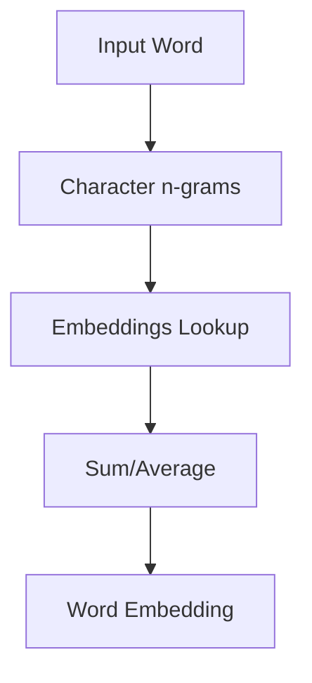

# Week 4 Session 2: Advanced Word Embeddings

## 1. Introduction to GloVe (Global Vectors for Word Representation)

GloVe, introduced by Pennington et al. in 2014, is another popular word embedding technique that aims to combine the advantages of global matrix factorization and local context window methods.

### 1.1 Key Concepts of GloVe

- Utilizes global word-word co-occurrence statistics
- Aims to capture both local and global context
- Based on the intuition that ratios of word-word co-occurrence probabilities have the potential to encode meaning

### 1.2 GloVe Algorithm

1. Construct a word-word co-occurrence matrix X
2. Define the objective function:

   J = Σᵢⱼ f(Xᵢⱼ)(wᵢᵀw̃ⱼ + bᵢ + b̃ⱼ - log Xᵢⱼ)²

   Where:

   - wᵢ and w̃ⱼ are word vectors
   - bᵢ and b̃ⱼ are bias terms
   - f(Xᵢⱼ) is a weighting function

3. Minimize the objective function using stochastic gradient descent

### 1.3 Implementing GloVe with Python

While there's no official GloVe implementation in popular Python libraries, we can use the `glove-python` package for demonstration:

```python
!pip install glove_python

import numpy as np
from glove import Corpus, Glove

# Sample corpus
sentences = [
    ['the', 'quick', 'brown', 'fox', 'jumps', 'over', 'the', 'lazy', 'dog'],
    ['the', 'cat', 'and', 'the', 'dog', 'are', 'natural', 'enemies'],
    ['the', 'dog', 'chases', 'the', 'cat', 'up', 'the', 'tree']
]

# Create a Corpus object
corpus = Corpus()
corpus.fit(sentences, window=10)

# Train the GloVe model
glove = Glove(no_components=100, learning_rate=0.05)
glove.fit(corpus.matrix, epochs=30, no_threads=4, verbose=True)
glove.add_dictionary(corpus.dictionary)

# Find similar words
similar_words = glove.most_similar('dog', number=3)
print("Words most similar to 'dog':", similar_words)

# Get word vector
dog_vector = glove.word_vectors[glove.dictionary['dog']]
print("Vector for 'dog':", dog_vector[:5])  # Showing first 5 dimensions
```

## 2. FastText: Subword-based Word Embeddings

FastText, developed by Facebook Research in 2016, extends the Word2Vec model by incorporating subword information.

### 2.1 Key Features of FastText

- Represents each word as a bag of character n-grams
- Can generate embeddings for out-of-vocabulary words
- Particularly effective for morphologically rich languages

### 2.2 FastText Architecture



### 2.3 Implementing FastText with Gensim

```python
from gensim.models import FastText

# Train FastText model
model = FastText(sentences=sentences, vector_size=100, window=5, min_count=1, workers=4)

# Find similar words
similar_words = model.wv.most_similar('dog', topn=3)
print("Words most similar to 'dog':", similar_words)

# Get vector for an out-of-vocabulary word
oov_vector = model.wv['doggie']
print("Vector for 'doggie':", oov_vector[:5])  # Showing first 5 dimensions

# Perform word analogy
result = model.wv.most_similar(positive=['dog', 'tree'], negative=['cat'], topn=1)
print("dog - cat + tree =", result[0][0])
```

## 3. Comparing Word2Vec, GloVe, and FastText

| Feature        | Word2Vec      | GloVe                | FastText                 |
| -------------- | ------------- | -------------------- | ------------------------ |
| Training       | Local context | Global co-occurrence | Local context + subwords |
| OOV words      | Cannot handle | Cannot handle        | Can generate embeddings  |
| Training speed | Fast          | Slower               | Similar to Word2Vec      |
| Performance    | Good          | Good                 | Better on rare words     |
| Morphology     | Not captured  | Not captured         | Captured                 |

## 4. Practical Applications of Word Embeddings

### 4.1 Text Classification

Word embeddings can significantly improve the performance of text classification tasks:

```python
from sklearn.model_selection import train_test_split
from sklearn.neural_network import MLPClassifier
from sklearn.metrics import classification_report
import numpy as np

# Sample data
texts = [
    "The cat and the dog are playing",
    "The stock market is booming",
    "The dog is chasing the cat",
    "Investors are buying stocks"
]
labels = [0, 1, 0, 1]  # 0: Animals, 1: Finance

# Function to get document embedding (average of word embeddings)
def get_doc_embedding(text, model):
    words = text.lower().split()
    word_vectors = [model.wv[word] for word in words if word in model.wv]
    return np.mean(word_vectors, axis=0)

# Prepare data
X = np.array([get_doc_embedding(text, model) for text in texts])
y = np.array(labels)

# Split data
X_train, X_test, y_train, y_test = train_test_split(X, y, test_size=0.2, random_state=42)

# Train classifier
clf = MLPClassifier(hidden_layer_sizes=(50,), max_iter=500)
clf.fit(X_train, y_train)

# Evaluate
y_pred = clf.predict(X_test)
print(classification_report(y_test, y_pred))
```

### 4.2 Named Entity Recognition (NER)

Word embeddings can be used as features for NER tasks:

```python
import nltk
from nltk import pos_tag, ne_chunk
from nltk.chunk import conlltags2tree, tree2conlltags

nltk.download('averaged_perceptron_tagger')
nltk.download('maxent_ne_chunker')
nltk.download('words')

def ner_with_embeddings(text, embedding_model):
    words = nltk.word_tokenize(text)
    pos_tags = pos_tag(words)
    ne_tree = ne_chunk(pos_tags)
    iob_tags = tree2conlltags(ne_tree)

    for word, pos, tag in iob_tags:
        if word in embedding_model.wv:
            embedding = embedding_model.wv[word]
            # Here you would typically use the embedding as a feature
            # for a more sophisticated NER model
            print(f"Word: {word}, POS: {pos}, NE Tag: {tag}, Embedding: {embedding[:3]}...")

# Example usage
text = "John works at Google in New York"
ner_with_embeddings(text, model)
```

## 5. Evaluating Word Embeddings

### 5.1 Intrinsic Evaluation: Word Similarity and Analogy Tasks

```python
def evaluate_word_similarity(model, word_pairs):
    human_scores = []
    model_scores = []
    for word1, word2, score in word_pairs:
        if word1 in model.wv and word2 in model.wv:
            human_scores.append(float(score))
            model_scores.append(model.wv.similarity(word1, word2))
    return np.corrcoef(human_scores, model_scores)[0, 1]

# Example word pairs with human-assigned similarity scores (0-10)
word_pairs = [
    ('cat', 'dog', 7.0),
    ('car', 'automobile', 9.0),
    ('book', 'paper', 6.5),
    ('computer', 'keyboard', 7.5),
    ('run', 'jog', 8.5)
]

similarity_score = evaluate_word_similarity(model, word_pairs)
print(f"Word similarity correlation: {similarity_score}")
```

### 5.2 Extrinsic Evaluation: Performance on Downstream Tasks

Evaluate embeddings based on their performance in specific NLP tasks like sentiment analysis, named entity recognition, or machine translation.

## 6. Challenges and Future Directions

1. **Contextual Embeddings**: Models like BERT and GPT produce context-dependent word embeddings, addressing polysemy.
2. **Multilingual Embeddings**: Creating embeddings that work across multiple languages.
3. **Bias in Embeddings**: Addressing and mitigating biases present in word embeddings.
4. **Efficient Training and Storage**: Developing methods for faster training and more efficient storage of embeddings.

## Conclusion

Advanced word embedding techniques like GloVe and FastText offer improvements over the basic Word2Vec model, especially in handling global co-occurrence statistics and subword information. These embeddings have become fundamental building blocks in many NLP tasks, significantly improving performance across various applications.

## Exercise

1. Train GloVe and FastText models on the same corpus you used for Word2Vec in the previous session.
2. Compare the performance of Word2Vec, GloVe, and FastText on a word analogy task.
3. Implement a simple sentiment analysis classifier using each of the three embedding types and compare their performance.
4. Analyze how well each model handles out-of-vocabulary words.

```python
# Your code here
```

This exercise will help you gain practical experience with different word embedding techniques and understand their strengths and weaknesses in various scenarios.
