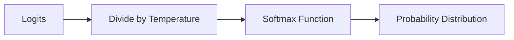

# Week 6 Session 2 - Sampling Methods and Text Generation

### Overview

In this session, we'll delve deeper into advanced usage of Large Language Model (LLM) APIs, focusing on sampling methods that control the randomness and creativity of generated text. We'll explore how parameters like `temperature`, `top_p`, `top_k`, and others influence the model's output. Through hands-on practice, we'll learn how to fine-tune these parameters to achieve desired results in various natural language processing tasks.

---

### 1. Recap of Previous Session

In our last session, we:

- **Set Up the OpenAI API**: Learned how to authenticate and make basic API calls.
- **Explored Tokenization**: Understood how text is broken down into tokens and the implications for API usage.
- **Made Initial API Calls**: Generated simple text based on prompts.
- **Discussed Best Practices**: Covered error handling, cost management, and rate limits.

---

### 2. Understanding Sampling Methods

Sampling methods determine how the language model selects the next word (token) during text generation. Adjusting these parameters allows us to control the creativity and randomness of the output.

#### **2.1 Temperature Sampling**

- **Definition**: A parameter (`temperature`) that scales the logits (raw outputs) before applying the softmax function to generate probabilities.
- **Range**: Typically between 0.0 and 1.0, but can go higher.
  - **Low Temperature (<0.5)**: Makes the model more deterministic and focused.
  - **High Temperature (>0.7)**: Increases randomness and creativity.

##### **Mathematical Explanation**

The probability $ p_i $ of each token $ i $ is calculated as:

$$
p_i = \frac{\exp{\left( \frac{z_i}{T} \right)}}{\sum_j \exp{\left( \frac{z_j}{T} \right)}}
$$

- $ z_i $ is the logit for token $ i $.
- $ T $ is the temperature.

As $ T $ increases, the probability distribution becomes more uniform.

##### **Diagram: Effect of Temperature on Probability Distribution**



#### **2.2 Top-p (Nucleus) Sampling**

- **Definition**: Instead of considering all possible tokens, the model considers only the smallest set of tokens whose cumulative probability exceeds a threshold `p`.
- **Parameter**: `top_p` ranges between 0.0 and 1.0.
  - **Low Top-p (<0.5)**: Only the most probable tokens are considered.
  - **High Top-p (~1.0)**: Considers a broader range of tokens.

##### **Visual Explanation**

- **Cumulative Probability Curve**: Plotting tokens sorted by probability.
- **Top-p Threshold**: A vertical line at cumulative probability `p`.

#### **2.3 Top-k Sampling**

- **Definition**: The model considers only the top `k` tokens with the highest probabilities.
- **Parameter**: `top_k` is an integer.
  - **Low Top-k**: Limits choices to the most probable tokens.
  - **High Top-k**: Allows more diversity.

#### **2.4 Frequency and Presence Penalties**

- **Frequency Penalty**: Reduces the likelihood of a token being selected again based on its frequency in the generated text.
- **Presence Penalty**: Penalizes tokens that have already appeared, encouraging the model to introduce new topics.

---

### 3. Practical Examples with Code

Let's apply these sampling methods in practice.

#### **3.1 Setting Up the Environment**

Ensure you have the OpenAI library installed and your API key set up.

```bash
export OPENAI_API_KEY='your-api-key-here'
```

```python
import openai

client = openai.OpenAI()

def generate_text(prompt, **kwargs):
    response = client.chat.completions.create(
        model="gpt-4o-mini",
        messages=[
            {"role": "system", "content": "You are a helpful assistant."},
            {"role": "user", "content": prompt}
        ],
        max_tokens=50,
        **kwargs
    )
    return response.choices[0].message.content
```

#### **3.2 Experimenting with Temperature**

We'll see how changing the temperature affects the output.

##### **Prompt**

```python
prompt = "Once upon a time in a distant land, there lived a"
```

##### **Code Example: Varying Temperature**

```python
temperatures = [0.2, 0.7, 1.0]

for temp in temperatures:
    text = generate_text(
        prompt=prompt,
        max_tokens=50,
        temperature=temp,
        n=1,
        stop=None
    )
    print(f"Temperature {temp}:\n{text}\n{'-'*40}")
```

##### **Expected Output**

- **Temperature 0.2**: More predictable, less creative.

  ```
  Temperature 0.2:
  young prince who was brave and kind. He loved exploring the forests and meeting new creatures. One day, he discovered a hidden path that led to a magical garden filled with beautiful flowers and singing birds.
  ----------------------------------------
  ```

- **Temperature 0.7**: Balanced creativity.

  ```
  Temperature 0.7:
  mysterious old wizard known for his wisdom. People from all over sought his advice, but he rarely revealed his secrets. One day, a young girl approached him with a question that intrigued him.
  ----------------------------------------
  ```

- **Temperature 1.0**: Highly creative, possibly less coherent.
  ```
  Temperature 1.0:
  a dragon who collected porcelain teacups instead of gold. The villagers thought it was peculiar, but the dragon didn't mind. He sipped tea every afternoon while reading ancient scrolls about the stars.
  ----------------------------------------
  ```

#### **3.3 Exploring Top-p Sampling**

Let's see how adjusting `top_p` affects the output.

##### **Code Example: Varying Top-p**

```python
top_p_values = [0.3, 0.7, 1.0]

for p in top_p_values:
    text = generate_text(
        prompt=prompt,
        max_tokens=50,
        temperature=0.7,
        top_p=p,
        n=1,
        stop=None
    )
    print(f"Top-p {p}:\n{text}\n{'-'*40}")
```

##### **Expected Output**

- **Top-p 0.3**: Limited to most probable tokens.

  ```
  Top-p 0.3:
  young prince who was brave and kind. He loved exploring the kingdom and helping his people. One day, he set out on a journey to find a legendary treasure that could bring prosperity to his land.
  ----------------------------------------
  ```

- **Top-p 0.7**: More diverse word choices.

  ```
  Top-p 0.7:
  curious adventurer with a heart full of dreams. She longed to explore the unknown and discover hidden wonders. With a map in hand, she embarked on a journey that would change her life forever.
  ----------------------------------------
  ```

- **Top-p 1.0**: Full range of possible tokens (similar to not using top-p).
  ```
  Top-p 1.0:
  a talking tree who whispered secrets to those who would listen. Travelers would come from afar to hear its tales of ancient times and forgotten realms, each story more enchanting than the last.
  ----------------------------------------
  ```

#### **3.4 Combining Temperature and Top-p**

You can use both parameters together to fine-tune the output.

##### **Code Example**

```python
text = generate_text(
    prompt=prompt,
    max_tokens=50,
    temperature=0.9,
    top_p=0.6,
    n=1,
    stop=None
)
print(f"Combined Parameters:\n{text}")
```

##### **Explanation**

- **Temperature 0.9**: High creativity.
- **Top-p 0.6**: Limits the choices to the most probable tokens, even with high temperature.

---

### 4. Advanced Parameters in OpenAI API

Beyond sampling methods, other parameters allow you to control the model's output.

#### **4.1 Controlling Output Length**

- **`max_tokens`**: Sets the maximum number of tokens in the generated response.
- **Limitation**: The total tokens (prompt + completion) must be within the model's context length (e.g., 4,096 tokens for `text-davinci-003`).

##### **Example**

```python
text = generate_text(
    prompt="Explain quantum computing in simple terms.",
    max_tokens=50
)
```

#### **4.2 Using Stop Sequences**

- **Purpose**: Tells the model when to stop generating text.
- **Parameter**: `stop` accepts a string or a list of strings.

##### **Example**

```python
text = generate_text(
    prompt="List three benefits of exercise:\n1.",
    max_tokens=50,
    stop=["\n"]
)
text = response.choices[0].text.strip()
print(f"Generated List:\n1.{text}")
```

##### **Expected Output**

```
Generated List:
1. Improves cardiovascular health.
```

#### **4.3 Formatting Output**

- **Instructional Prompts**: Ask the model to format the output in a specific way.
- **JSON Output**: Useful for structured data extraction.

##### **Example: Generating JSON**

```python
prompt = """
Extract the following information and provide it in JSON format:
- Name
- Age
- Occupation

Text: "John Doe is a 29-year-old software engineer living in San Francisco."
"""

text = generate_text(
    prompt=prompt,
    max_tokens=100,
    temperature=0,
    stop=None
)
print(text)
```

##### **Expected Output**

```json
{
  "Name": "John Doe",
  "Age": 29,
  "Occupation": "Software Engineer"
}
```

---

### 5. Hands-On Exercise

**Objective**: Write a script that generates creative story prompts by adjusting sampling parameters.

#### **Instructions**

1. **Choose a Base Prompt**: For example, "In a world where robots have emotions, a single robot begins to..."
2. **Experiment with Different Values**:
   - Vary `temperature` between 0.5 and 1.2.
   - Adjust `top_p` between 0.5 and 1.0.
3. **Observe the Outputs**:
   - Note how the changes affect the creativity and coherence.
4. **Document Findings**:
   - Record the parameter values and corresponding outputs.

#### **Sample Code**

```python
prompt = "In a world where robots have emotions, a single robot begins to"

temperatures = [0.5, 0.9, 1.2]
top_p_values = [0.5, 0.8, 1.0]

for temp in temperatures:
    for p in top_p_values:
        text = generate_text(
            prompt=prompt,
            max_tokens=60,
            temperature=temp,
            top_p=p,
            n=1,
            stop="."
        )
        print(f"Temperature: {temp}, Top-p: {p}\n{text}\n{'-'*50}")
```

---

### 6. Common Issues and Troubleshooting

#### **Repetitive or Nonsensical Output**

- **Cause**: Too low or too high temperature.
- **Solution**: Adjust `temperature` and `top_p` to find a balance.

#### **API Errors**

- **InvalidRequestError**: Check if parameters are within allowed ranges.
- **RateLimitError**: Implement retries with exponential backoff.

#### **Formatting Issues**

- **Unwanted Text**: Use `stop` sequences to prevent the model from generating beyond the desired point.
- **Incorrect Output Format**: Provide clear instructions and examples in the prompt.

---

### 7. Summary and Key Takeaways

- **Sampling Methods**: Understanding `temperature`, `top_p`, and `top_k` is crucial for controlling text generation.
- **Parameter Tuning**: Adjusting these parameters allows you to balance creativity and coherence.
- **Advanced Controls**: Use `max_tokens`, `stop` sequences, and formatting instructions to refine outputs.
- **Hands-On Practice**: Experimenting with different settings is the best way to learn their effects.

---

### 8. Assignments for Next Week

1. **Sampling Methods Report**:

   - Experiment with different combinations of `temperature` and `top_p` using a prompt of your choice.
   - Prepare a short report summarizing your findings, including code snippets and generated outputs.

2. **Create a Controlled Output**:

   - Write a script that generates a list of at least five items (e.g., "Top 5 programming languages in 2024") using the OpenAI API.
   - Ensure the output is formatted correctly and stops after listing five items.

3. **Structured Data Extraction**:
   - Use the API to extract specific information from a block of text and output it in JSON format.
   - Share your prompt, code, and the results.

---

### 9. Closing Remarks

Understanding and effectively using sampling methods is essential for harnessing the full potential of LLM APIs. By mastering these parameters, you can generate text that meets specific requirements for creativity, coherence, and format. Continue to experiment and explore the possibilities offered by these powerful tools.
