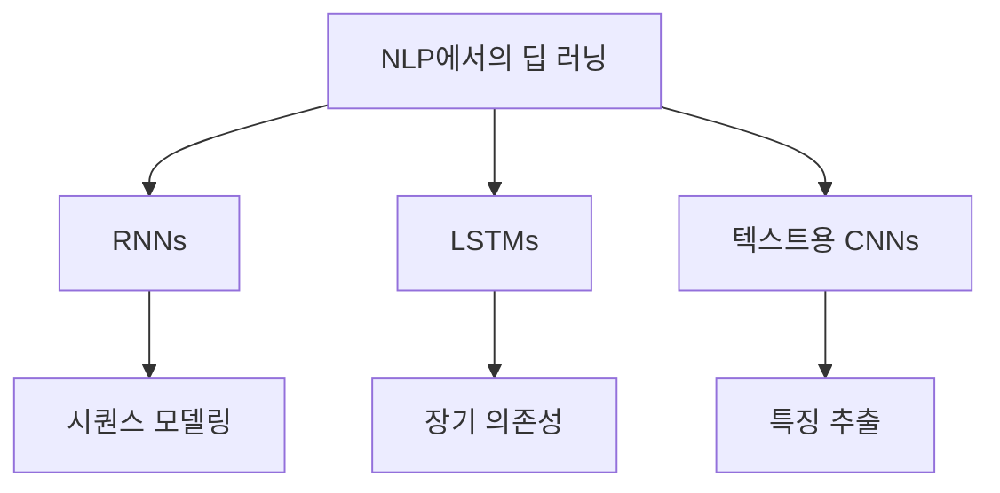
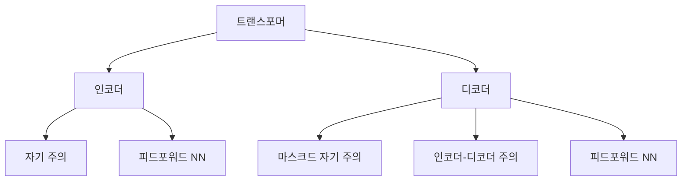
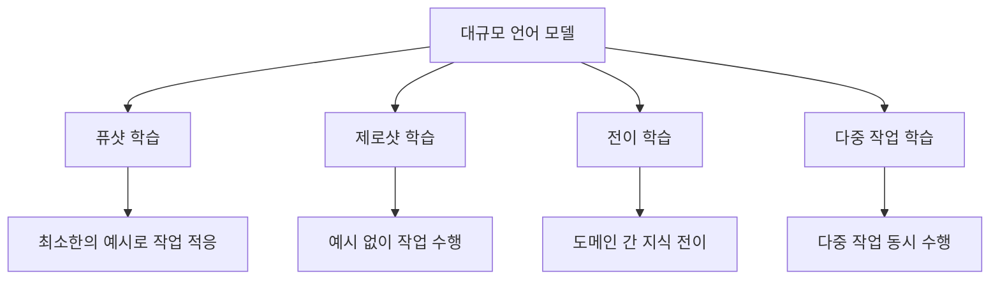

# 세션 2 - 현대 자연어처리의 혁명

## 6. 현대 NLP로의 진화

전통적인 NLP 방법에서 현대적 접근 방식으로의 전환은 특히 딥 러닝 분야의 기계 학습 발전에 의해 주도되었습니다. 이러한 진화는 전통적인 NLP 시스템이 직면한 많은 도전 과제들을 해결하고 다양한 NLP 작업에서 성능을 크게 향상시켰습니다.

### 6.1. 단어 임베딩의 도입

단어 임베딩은 NLP 시스템에서 단어를 표현하는 방식의 근본적인 변화를 나타냅니다. 전통적인 원-핫 인코딩이나 단어 주머니 모델과 달리, 단어 임베딩은 단어들을 연속적인 벡터 공간의 밀집 벡터로 표현하여 단어 간의 의미적 관계를 포착합니다.

단어 임베딩의 주요 특징:

- 유사한 의미를 가진 단어들은 벡터 공간에서 서로 가깝게 위치합니다.
- 벡터 산술을 통해 의미적 관계를 포착할 수 있습니다.
- 원-핫 인코딩에 비해 낮은 차원의 표현을 사용합니다.

대표적인 단어 임베딩 모델:

1. Word2Vec (2013)
2. GloVe (Global Vectors for Word Representation, 2014)
3. FastText (2016)

Gensim을 사용한 Word2Vec 예제:

```python
from gensim.models import Word2Vec
from gensim.models.word2vec import LineSentence

# 'corpus.txt' 파일에 문장당 한 줄씩 있다고 가정
sentences = LineSentence('corpus.txt')

# Word2Vec 모델 훈련
model = Word2Vec(sentences, vector_size=100, window=5, min_count=1, workers=4)

# 유사한 단어 찾기
similar_words = model.wv.most_similar('왕', topn=5)
print("'왕'과 가장 유사한 단어들:")
for word, score in similar_words:
    print(f"{word}: {score:.4f}")

# 단어 산술 수행
result = model.wv.most_similar(positive=['왕', '여자'], negative=['남자'], topn=1)
print("\n왕 - 남자 + 여자 =", result[0][0])
```

단어 임베딩의 장점:

1. 단어 간의 의미적 관계 포착
2. 단어 표현의 차원 축소
3. 사전 학습된 임베딩을 사용한 전이 학습 가능

### 6.2. NLP에서의 딥 러닝 부상

NLP에서 딥 러닝 기술의 채택은 다양한 작업에서 성능을 크게 향상시켰습니다. NLP에서 사용되는 주요 신경망 아키텍처는 다음과 같습니다:

1. 순환 신경망 (RNNs)
2. 장단기 메모리 네트워크 (LSTMs)
3. 텍스트를 위한 합성곱 신경망 (CNNs)



PyTorch를 사용한 감성 분석을 위한 간단한 RNN 예제:

```python
import torch
import torch.nn as nn

class SimpleRNN(nn.Module):
    def __init__(self, vocab_size, embedding_dim, hidden_dim, output_dim):
        super().__init__()
        self.embedding = nn.Embedding(vocab_size, embedding_dim)
        self.rnn = nn.RNN(embedding_dim, hidden_dim)
        self.fc = nn.Linear(hidden_dim, output_dim)

    def forward(self, text):
        embedded = self.embedding(text)
        output, hidden = self.rnn(embedded)
        return self.fc(hidden.squeeze(0))

# 사용 예시 (전처리된 데이터 가정)
vocab_size = 10000
embedding_dim = 100
hidden_dim = 256
output_dim = 2  # 이진 감성 (긍정/부정)

model = SimpleRNN(vocab_size, embedding_dim, hidden_dim, output_dim)
```

NLP에서 딥 러닝 모델의 장점:

1. 자동 특징 학습
2. 복잡한 패턴과 장거리 의존성 포착 능력
3. 다양한 NLP 작업에 적응할 수 있는 유연성

### 6.3. 트랜스포머 모델의 등장

2017년 트랜스포머 아키텍처의 소개 ("Attention Is All You Need", Vaswani et al.)는 NLP의 중요한 이정표가 되었습니다. 트랜스포머는 RNN과 LSTM의 한계, 예를 들어 계산의 병렬화 어려움과 장거리 의존성 포착의 어려움을 해결합니다.

트랜스포머 아키텍처의 주요 구성 요소:

1. 자기 주의 메커니즘
2. 다중 헤드 주의
3. 위치 인코딩
4. 피드포워드 신경망



주요 트랜스포머 기반 모델:

1. BERT (Bidirectional Encoder Representations from Transformers)
2. GPT (Generative Pre-trained Transformer)
3. T5 (Text-to-Text Transfer Transformer)

시퀀스 분류를 위한 사전 학습된 BERT 모델 사용 예제:

```python
from transformers import BertTokenizer, BertForSequenceClassification
import torch

# 사전 학습된 모델과 토크나이저 로드
model_name = 'bert-base-multilingual-uncased'
tokenizer = BertTokenizer.from_pretrained(model_name)
model = BertForSequenceClassification.from_pretrained(model_name)

# 예시 텍스트
text = "이 영화는 정말 환상적이에요! 정말 즐겁게 봤습니다."

# 텍스트 토큰화 및 인코딩
inputs = tokenizer(text, return_tensors="pt", truncation=True, padding=True, max_length=512)

# 예측
with torch.no_grad():
    outputs = model(**inputs)
    logits = outputs.logits
    predicted_class = torch.argmax(logits, dim=1).item()

print(f"예측된 클래스: {predicted_class}")
```

트랜스포머 모델의 장점:

1. 병렬화 가능한 계산
2. 장거리 의존성 포착 능력
3. 대규모 코퍼스에 대한 효과적인 사전 학습
4. 다양한 NLP 작업에서 최고 수준의 성능

## 7. 대규모 언어 모델 (LLMs)

대규모 언어 모델은 현재 NLP 분야의 최첨단 기술을 대표하며, 언어 이해와 생성에 있어 전례 없는 능력을 제공합니다.

### 7.1. 정의와 능력

LLM은 일반적으로 트랜스포머 아키텍처를 기반으로 한 대규모 신경망으로, 방대한 양의 텍스트 데이터로 훈련됩니다. LLM의 특징:

1. 수십억 개의 매개변수
2. 다양하고 방대한 코퍼스에 대한 학습
3. 작업별 학습 없이 광범위한 언어 작업 수행 능력

LLM의 주요 능력:

1. 텍스트 생성
2. 질문 답변
3. 요약
4. 번역
5. 코드 생성
6. 퓨샷 및 제로샷 학습



### 7.2. 예시와 그 영향

주요 LLM 예시:

1. GPT-3 및 GPT-4 (OpenAI)
2. PaLM (Google)
3. BLOOM (BigScience)
4. LLaMA (Meta)

이러한 모델들은 다양한 분야에서 놀라운 능력을 보여주었습니다:

1. 자연어 이해 및 생성
2. 코드 생성 및 디버깅
3. 창의적 글쓰기 및 스토리텔링
4. 언어 번역
5. 질문 답변 및 정보 검색

OpenAI GPT-3 API를 사용한 텍스트 생성 예제:

```python
import openai

# OpenAI API 키 설정
openai.api_key = '여러분의-api-키'

def generate_text(prompt, max_tokens=100):
    response = openai.Completion.create(
        engine="text-davinci-002",
        prompt=prompt,
        max_tokens=max_tokens,
        n=1,
        stop=None,
        temperature=0.7,
    )
    return response.choices[0].text.strip()

# 사용 예시
prompt = "양자 컴퓨팅의 개념을 간단히 설명해주세요:"
generated_text = generate_text(prompt)
print(generated_text)
```

LLM의 영향:

1. 자연어 인터페이스의 혁신
2. 더 정교한 AI 어시스턴트 구현
3. 다양한 분야의 연구 및 개발 가속화
4. AI 능력과 잠재적 오용에 대한 윤리적 우려 제기

## 8. NLP 작업의 패러다임 전환

LLM의 등장은 NLP 작업에 접근하고 해결하는 방식에 중요한 패러다임 전환을 가져왔습니다.

### 8.1. 작업별 모델에서 범용 모델로

전통적인 NLP 접근 방식은 종종 각 특정 작업에 대해 별도의 모델을 개발하는 것이었습니다. 이와 대조적으로 LLM은 더 다재다능한 접근 방식을 제공합니다:

1. 다중 작업을 위한 단일 모델
2. 미세 조정 또는 프롬프팅을 통한 적응
3. 작업별 데이터 주석 필요성 감소

범용 모델의 장점:

1. 개발 시간 및 리소스 감소
2. 전이 학습을 통한 성능 향상
3. 새로운 작업에 빠르게 적응할 수 있는 유연성

### 8.2. 퓨샷 및 제로샷 학습

LLM은 대규모 작업별 데이터셋의 필요성을 줄이는 새로운 학습 패러다임을 도입했습니다:

1. 퓨샷 학습: 몇 가지 예시만으로 작업 수행
2. 제로샷 학습: 특정 학습 예시 없이 작업 완료

GPT-3를 사용한 제로샷 분류 예제:

```python
def zero_shot_classification(text, categories):
    prompt = f"다음 텍스트를 주어진 카테고리 중 하나로 분류하세요: {', '.join(categories)}.\n\n텍스트: {text}\n\n카테고리:"
    return generate_text(prompt, max_tokens=1)

# 사용 예시
text = "오늘 주식 시장은 기술주 주도로 큰 상승세를 보였습니다."
categories = ["정치", "경제", "스포츠", "기술"]
result = zero_shot_classification(text, categories)
print(f"분류된 카테고리: {result}")
```

퓨샷 및 제로샷 학습의 장점:

1. 대규모 레이블링된 데이터셋에 대한 의존도 감소
2. 새로운 작업이나 도메인에 빠르게 적응할 수 있는 능력
3. 보지 못한 예시에 대한 일반화 능력 향상

## 9. 현재 상태와 미래 방향

### 9.1. LLM의 진행 중인 발전

LLM 관련 현재 연구는 여러 주요 영역에 초점을 맞추고 있습니다:

1. 모델 크기를 더욱 확장 (예: GPT-4, PaLM)
2. 효율성 개선 및 계산 요구사항 감소
3. 사실적 정확성 향상 및 환각 현상 감소
4. 더 제어 가능하고 조정 가능한 모델 개발
5. 텍스트, 이미지, 오디오를 처리할 수 있는 다중 모달 모델 생성

새롭게 등장하는 기술:

1. 검색 증강 생성
2. 개선된 안전성과 정렬을 위한 헌법적 AI
3. 효율적인 미세 조정 방법 (예: LoRA, 프리픽스 튜닝)

### 9.2. 새로운 도전과 기회

NLP가 계속 발전함에 따라 연구자들과 실무자들은 새로운 도전과 기회에 직면하고 있습니다:

도전:

1. 윤리적 문제 (편향, 프라이버시, 오용)
2. 모델 결정의 해석 가능성과 설명 가능성
3. 사실적 정확성 보장 및 잘못된 정보 감소
4. 대규모 모델 학습과 관련된 환경 문제 해결

기회:

1. 인간-AI 협업 발전
2. 강력한 NLP 도구에 대한 접근성 민주화
3. AI 능력의 경계 확장
4. 다양한 분야의 복잡한 실제 문제 해결

LLM의 잠재적 편향성 탐색 예제:

```python
def probe_model_bias(demographic_groups, context):
    prompt = f"""
    다음 인구통계학적 그룹에 대한 언어 모델 응답의 잠재적 편향성을 분석하세요: {', '.join(demographic_groups)}

    컨텍스트: {context}

    각 그룹에 대해 잠재적 편향성에 대한 간단한 분석을 제공하세요:
    """
    return generate_text(prompt, max_tokens=200)

# 사용 예시
demographics = ["성별", "인종", "나이", "사회경제적 지위"]
context = "기술 업계에서의 구직자 평가"
bias_analysis = probe_model_bias(demographics, context)
print(bias_analysis)
```

## 결론

현대적 접근 방식, 특히 대규모 언어 모델의 발전으로 NLP는 크게 변화했습니다. 이러한 발전은 전통적인 방법의 많은 한계를 해결하고 자연어 이해와 생성의 새로운 가능성을 열었습니다.

주요 요점:

1. 단어 임베딩과 딥 러닝 기술은 NLP 성능을 크게 향상시켰습니다.
2. 트랜스포머 모델, 특히 LLM은 현재 NLP의 최첨단 기술을 대표합니다.
3. 범용 모델과 퓨샷/제로샷 학습으로의 패러다임 전환은 NLP 작업에 접근하는 방식을 변화시켰습니다.
4. LLM의 지속적인 발전은 흥미로운 기회와 함께 중요한 도전 과제를 제시합니다.

앞으로 나아가면서, 이러한 기술의 엄청난 잠재력과 그 한계 및 윤리적 함의를 신중히 고려하는 것이 중요합니다. NLP의 미래는 인간-AI 상호작용을 발전시키고 다양한 분야에서 복잡한 문제를 해결하는 데 큰 가능성을 보여줍니다.
