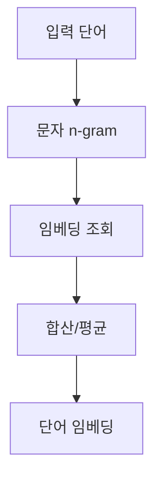

# 4주차 2세션 - 고급 단어 임베딩

## 1. GloVe (Global Vectors for Word Representation) 소개

GloVe는 2014년 Pennington 등이 소개한 또 다른 인기 있는 단어 임베딩 기법으로, 전역 행렬 분해와 지역 문맥 윈도우 방법의 장점을 결합하는 것을 목표로 합니다.

### 1.1 GloVe의 주요 개념

- 전역 단어-단어 동시 출현 통계를 활용
- 지역 및 전역 문맥을 모두 포착하는 것을 목표로 함
- 단어-단어 동시 출현 확률의 비율이 의미를 인코딩할 수 있다는 직관에 기반

### 1.2 GloVe 알고리즘

1. 단어-단어 동시 출현 행렬 X 구성
2. 목적 함수 정의:

   J = Σᵢⱼ f(Xᵢⱼ)(wᵢᵀw̃ⱼ + bᵢ + b̃ⱼ - log Xᵢⱼ)²

   여기서:

   - wᵢ와 w̃ⱼ는 단어 벡터
   - bᵢ와 b̃ⱼ는 편향 항
   - f(Xᵢⱼ)는 가중치 함수

3. 확률적 경사 하강법을 사용하여 목적 함수 최소화

### 1.3 Python으로 GloVe 구현하기

공식적인 Python GloVe 구현은 없지만, 데모를 위해 `glove-python` 패키지를 사용할 수 있습니다:

```python
!pip install glove_python

import numpy as np
from glove import Corpus, Glove

# 샘플 코퍼스
sentences = [
    ['빠른', '갈색', '여우가', '게으른', '개를', '뛰어넘습니다'],
    ['고양이와', '개는', '천적입니다'],
    ['개가', '고양이를', '나무', '위로', '쫓아갑니다']
]

# Corpus 객체 생성
corpus = Corpus()
corpus.fit(sentences, window=10)

# GloVe 모델 학습
glove = Glove(no_components=100, learning_rate=0.05)
glove.fit(corpus.matrix, epochs=30, no_threads=4, verbose=True)
glove.add_dictionary(corpus.dictionary)

# 유사한 단어 찾기
similar_words = glove.most_similar('개', number=3)
print("'개'와 가장 유사한 단어들:", similar_words)

# 단어 벡터 얻기
dog_vector = glove.word_vectors[glove.dictionary['개']]
print("'개'의 벡터:", dog_vector[:5])  # 처음 5차원만 표시
```

## 2. FastText: 하위 단어 기반 단어 임베딩

FastText는 2016년 Facebook Research에서 개발한 것으로, 하위 단어 정보를 포함하여 Word2Vec 모델을 확장합니다.

### 2.1 FastText의 주요 특징

- 각 단어를 문자 n-gram의 집합으로 표현
- 어휘 외 단어에 대한 임베딩 생성 가능
- 형태학적으로 풍부한 언어에 특히 효과적

### 2.2 FastText 아키텍처



### 2.3 Gensim으로 FastText 구현하기

```python
from gensim.models import FastText

# FastText 모델 학습
model = FastText(sentences=sentences, vector_size=100, window=5, min_count=1, workers=4)

# 유사한 단어 찾기
similar_words = model.wv.most_similar('개', topn=3)
print("'개'와 가장 유사한 단어들:", similar_words)

# 어휘 외 단어에 대한 벡터 얻기
oov_vector = model.wv['강아지']
print("'강아지'의 벡터:", oov_vector[:5])  # 처음 5차원만 표시

# 단어 유추 수행
result = model.wv.most_similar(positive=['개', '나무'], negative=['고양이'], topn=1)
print("개 - 고양이 + 나무 =", result[0][0])
```

## 3. Word2Vec, GloVe, FastText 비교

| 특징      | Word2Vec      | GloVe          | FastText                 |
| --------- | ------------- | -------------- | ------------------------ |
| 학습      | 지역 문맥     | 전역 동시 출현 | 지역 문맥 + 하위 단어    |
| OOV 단어  | 처리 불가     | 처리 불가      | 임베딩 생성 가능         |
| 학습 속도 | 빠름          | 더 느림        | Word2Vec과 유사          |
| 성능      | 좋음          | 좋음           | 희귀 단어에 대해 더 나음 |
| 형태학    | 포착하지 않음 | 포착하지 않음  | 포착함                   |

## 4. 단어 임베딩의 실제 응용

### 4.1 텍스트 분류

단어 임베딩은 텍스트 분류 작업의 성능을 크게 향상시킬 수 있습니다:

```python
from sklearn.model_selection import train_test_split
from sklearn.neural_network import MLPClassifier
from sklearn.metrics import classification_report
import numpy as np

# 샘플 데이터
texts = [
    "고양이와 개가 놀고 있습니다",
    "주식 시장이 호황입니다",
    "개가 고양이를 쫓고 있습니다",
    "투자자들이 주식을 매수하고 있습니다"
]
labels = [0, 1, 0, 1]  # 0: 동물, 1: 금융

# 문서 임베딩을 얻는 함수 (단어 임베딩의 평균)
def get_doc_embedding(text, model):
    words = text.lower().split()
    word_vectors = [model.wv[word] for word in words if word in model.wv]
    return np.mean(word_vectors, axis=0)

# 데이터 준비
X = np.array([get_doc_embedding(text, model) for text in texts])
y = np.array(labels)

# 데이터 분할
X_train, X_test, y_train, y_test = train_test_split(X, y, test_size=0.2, random_state=42)

# 분류기 학습
clf = MLPClassifier(hidden_layer_sizes=(50,), max_iter=500)
clf.fit(X_train, y_train)

# 평가
y_pred = clf.predict(X_test)
print(classification_report(y_test, y_pred))
```

### 4.2 개체명 인식 (NER)

단어 임베딩은 NER 작업의 특성으로 사용될 수 있습니다:

```python
import nltk
from nltk import pos_tag, ne_chunk
from nltk.chunk import conlltags2tree, tree2conlltags

nltk.download('averaged_perceptron_tagger')
nltk.download('maxent_ne_chunker')
nltk.download('words')

def ner_with_embeddings(text, embedding_model):
    words = nltk.word_tokenize(text)
    pos_tags = pos_tag(words)
    ne_tree = ne_chunk(pos_tags)
    iob_tags = tree2conlltags(ne_tree)

    for word, pos, tag in iob_tags:
        if word in embedding_model.wv:
            embedding = embedding_model.wv[word]
            # 여기서 일반적으로 임베딩을 더 정교한 NER 모델의 특성으로 사용합니다
            print(f"단어: {word}, 품사: {pos}, NE 태그: {tag}, 임베딩: {embedding[:3]}...")

# 사용 예
text = "김철수는 서울에 있는 삼성전자에서 일합니다"
ner_with_embeddings(text, model)
```

## 5. 단어 임베딩 평가

### 5.1 내재적 평가: 단어 유사도 및 유추 작업

```python
def evaluate_word_similarity(model, word_pairs):
    human_scores = []
    model_scores = []
    for word1, word2, score in word_pairs:
        if word1 in model.wv and word2 in model.wv:
            human_scores.append(float(score))
            model_scores.append(model.wv.similarity(word1, word2))
    return np.corrcoef(human_scores, model_scores)[0, 1]

# 인간이 할당한 유사도 점수(0-10)가 있는 예시 단어 쌍
word_pairs = [
    ('고양이', '개', 7.0),
    ('자동차', '자동차', 9.0),
    ('책', '종이', 6.5),
    ('컴퓨터', '키보드', 7.5),
    ('달리다', '조깅하다', 8.5)
]

similarity_score = evaluate_word_similarity(model, word_pairs)
print(f"단어 유사도 상관관계: {similarity_score}")
```

### 5.2 외재적 평가: 하위 작업에서의 성능

감성 분석, 개체명 인식, 기계 번역과 같은 특정 NLP 작업에서의 성능을 기반으로 임베딩을 평가합니다.

## 6. 도전 과제와 향후 방향

1. **문맥적 임베딩**: BERT와 GPT와 같은 모델은 다의어를 다루는 문맥 의존적 단어 임베딩을 생성합니다.
2. **다국어 임베딩**: 여러 언어에서 작동하는 임베딩 생성.
3. **임베딩의 편향**: 단어 임베딩에 존재하는 편향을 해결하고 완화.
4. **효율적인 학습 및 저장**: 더 빠른 학습과 더 효율적인 임베딩 저장을 위한 방법 개발.

## 결론

GloVe와 FastText와 같은 고급 단어 임베딩 기법은 기본 Word2Vec 모델에 비해 개선을 제공하며, 특히 전역 동시 출현 통계와 하위 단어 정보 처리에서 뛰어납니다. 이러한 임베딩은 많은 NLP 작업에서 기본적인 구성 요소가 되었으며, 다양한 응용 프로그램에서 성능을 크게 향상시켰습니다.

## 연습 문제

1. 이전 세션에서 Word2Vec에 사용한 동일한 코퍼스에 대해 GloVe와 FastText 모델을 학습시킵니다.
2. 단어 유추 작업에서 Word2Vec, GloVe, FastText의 성능을 비교합니다.
3. 세 가지 임베딩 유형을 각각 사용하여 간단한 감성 분석 분류기를 구현하고 성능을 비교합니다.
4. 각 모델이 어휘 외 단어를 얼마나 잘 처리하는지 분석합니다.

```python
# 여기에 코드를 작성하세요
```

이 연습을 통해 다양한 단어 임베딩 기법에 대한 실제 경험을 쌓고 다양한 시나리오에서 각 기법의 장단점을 이해할 수 있습니다.
